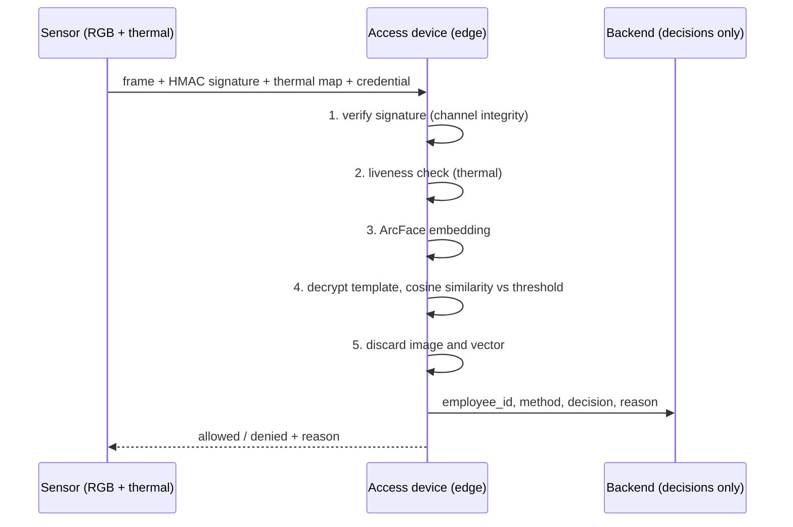

# Lab 04 · Privacy-First Face Access Control


> **Face recognition for access control without storing faces.**
> A reproducible proof of concept (PoC) of a 1:1 verification device with signed sensor frames, liveness detection, an encrypted template that travels on the employee's credential, and a backend that only stores decisions.

Part of the **Computer Vision Reference Architectures** series. This is the code behind the article *"Face Recognition for Access Control Without Storing Faces"*.

> **Not legal advice.** Biometric data is sensitive under laws such as the GDPR and Mexican personal data law. Validate obligations (consent, privacy notice, retention, impact assessment) with your compliance team.

---

## Table of contents

- [The business problem](#the-business-problem)
- [What this lab does](#what-this-lab-does)
- [Architecture](#architecture)
- [Components](#components)
- [Quick start](#quick-start)
- [Configuration](#configuration)
- [Using your own photos](#using-your-own-photos)
- [API reference](#api-reference)
- [What to expect](#what-to-expect)
- [Project structure](#project-structure)
- [Scope and limitations](#scope-and-limitations)
- [Troubleshooting](#troubleshooting)
- [References](#references)

---

## The business problem

A financial services company runs continuous face recognition in its offices and data center. An internal audit found three problems:

1. Performance varies with pose and partial occlusion.
2. It shows bias between demographic groups because of unbalanced training data.
3. It can be fooled with AI-generated fake videos.

It also keeps every employee's face data on a **central server** and compares whoever arrives against that whole database (1:N identification). If that server is breached, the biometrics of the entire workforce are exposed, and *a password can be replaced but a face cannot.*

The goal is verifiable access that checks the person **without becoming the custodian of thousands of faces**.

## What this lab does

It replaces centralized 1:N identification with a **defense-in-depth 1:1 flow**:

| Control | What it does |
|---|---|
| **1:1 verification** | The person presents a credential. Only that credential's owner is verified, nobody is "searched for" |
| **Encrypted template on the credential** | The ArcFace vector is encrypted with AES-GCM, bound to the employee ID, and carried by the employee, not stored centrally |
| **Channel integrity** | Every frame carries an HMAC-SHA256 signature from the (simulated) sensor, so an injected fake video is rejected |
| **Liveness detection (PAD)** | A simulated thermal channel rejects printed photos, screens, and masks |
| **Immediate discard** | The image and the vector are dropped right after the decision |
| **Decision-only backend** | The backend stores ID, time, method, decision, and reason. No images, no vectors |
| **Consent and PIN path** | Without consent, no enrollment. The employee uses credential + PIN (salted PBKDF2 hash) |

The evaluation then measures **FMR, FNMR** (overall and by subgroup), **APCER / BPCER** per attack type (ISO/IEC 30107-3 metrics), **injection rejection**, and a **privacy check** of the backend schema.

## Architecture



Without consent the flow never touches biometrics: enrollment returns `403` and the employee uses `credential + PIN`, verified by the backend through a salted hash.

## Components

| File | Role |
|---|---|
| `biometrics/device.py` | Edge device (FastAPI, port 8001). Endpoints `/enroll`, `/verify`, `/pin`, `/health`. All biometric processing happens here |
| `biometrics/backend.py` | Access backend (FastAPI, port 8002). Stores decisions and salted PIN hashes in SQLite. `/schema` exposes every stored column as privacy proof |
| `biometrics/face.py` | InsightFace `buffalo_l` (RetinaFace detector + ArcFace recognition), plus a simple yaw proxy for pose subgroups |
| `biometrics/pad.py` | Liveness detection over a **simulated** thermal channel (genuine, photo, screen, mask) |
| `biometrics/security.py` | HMAC frame signing, AES-GCM template encryption, and credential packaging |
| `biometrics/evaluate.py` | Evaluation job. Enrolls, runs genuine / impostor / attack / injection tests, computes metrics, and writes figures |
| `common/utils.py` | Paths, cached downloads, `metrics.json` metadata, and optional MLflow / MinIO integrations |

## Quick start

### Requirements

- Docker with Compose v2
- About **8 GB of memory** assigned to Docker
- Internet access on the first run. It downloads the **LFW** dataset (through scikit-learn) and the **InsightFace buffalo_l** models. The first run can take several minutes
- Ports **8001** and **8002** free
- No GPU needed

### 1. Configure

```bash
cp .env.example .env
```

> **Change the demo keys** (`SENSOR_KEY`, `TEMPLATE_KEY`) in `.env` if you reuse this code anywhere beyond a demo. The `.env` file is git-ignored.

### 2. Run

**Linux / macOS / WSL:**

```bash
bash run.sh
```

**Windows PowerShell:**

```powershell
powershell -ExecutionPolicy Bypass -File .\run.ps1
```

**Or step by step (any OS):**

```bash
docker compose build
docker compose up -d bio-backend bio-device
docker compose --profile jobs run --rm bio-eval
docker compose down
```

The evaluation waits for both services to be healthy (the first start downloads the face models).

## Configuration

Set these in `.env`:

| Variable | Default | What it does |
|---|---|---|
| `BIO_IDENTITIES` | `30` | Number of identities taken from LFW |
| `VERIFY_THRESHOLD` | `0.35` | Cosine-similarity threshold on the device |
| `SENSOR_KEY` | demo value | HMAC key of the simulated attested sensor. **Change it** |
| `TEMPLATE_KEY` | demo value | Key used to encrypt templates (AES-GCM). **Change it** |
| `BACKEND_URL` / `DEVICE_URL` | internal Docker URLs | Service addresses used inside the Compose network |
| `MLFLOW_TRACKING_URI`, `MINIO_ENDPOINT` | *(unset)* | Optional integrations. The lab runs without them |

## Using your own photos

By default the lab uses LFW. To use your own data instead, create one folder per person:

```text
data/faces/ana/1.jpg  2.jpg  3.jpg  4.jpg
data/faces/luis/1.jpg 2.jpg ...
```

- Minimum **2 photos per person** (4 is ideal).
- **Only use photos of people who gave explicit consent.**
- If this folder contains people, the evaluation uses it instead of LFW.

## API reference

While the stack is up (`docker compose up -d bio-backend bio-device`):

| Service | Endpoint | Purpose |
|---|---|---|
| Device `:8001` | `POST /enroll` | Needs `consent=true`. Returns the credential with the encrypted template |
| Device `:8001` | `POST /verify` | Signature → liveness → ArcFace → 1:1 decision |
| Device `:8001` | `POST /pin` | Fallback route, delegated to the backend |
| Backend `:8002` | `GET /events` | Latest stored decisions |
| Backend `:8002` | `GET /schema` | Every table and column the backend stores |
| Both | `GET /health` | Health check |

FastAPI also serves interactive docs at `http://localhost:8001/docs` and `http://localhost:8002/docs`.

## What to expect

Everything is written to `results/biometrics/`:

| File | Content |
|---|---|
| `metrics.json` | All metrics, plus a `_meta` block with parameters, library versions, and machine |
| `biometrics.png` | Score distributions, FNMR by subgroup, and liveness / injection results |
| `backend.db` | The decisions the backend stored (inspect it to confirm there are no biometrics) |

### Results from the reference run

30 LFW identities, a simulated thermal channel. 29 were enrolled and one tested the no-consent path.

| Control | Result |
|---|---|
| Impostors accepted (FMR) | 0% (0 of 87 attempts) |
| Legitimate users rejected (FNMR) | 1.1% (1 of 87 genuine attempts) |
| FNMR at a threshold calibrated for FMR ≤ 1% (0.13 instead of 0.35) | 0% |
| Photos and screens accepted (APCER) | 0% (20 attempts each) |
| Legitimate users rejected by liveness (BPCER) | 0% (0 of 87) |
| Injected images accepted | 0% (0 of 20) |
| High-quality masks accepted | 5% (1 of 20) |
| Enrollment without consent | Rejected, redirected to PIN. Correct PIN allowed, wrong PIN denied |
| Data in the central system | Only identifier, time, method, decision, and reason, plus salted PIN hashes |

**How to read it, and why zero is not a guarantee:**

- 0 of 87 impostor attempts only supports an FMR **below about 3.4%** at 95% confidence. Photos, screens, and injections were each tested 20 times (upper bound about 14%). Backing an APCER of 1% needs hundreds of attempts per attack type.
- The calibrated threshold was fit on the same impostor attempts, so its 0% FNMR is optimistic.
- The 5% mask result is **one** attempt in 20 (95% interval roughly 0.1% to 25%).
- **Nothing can be concluded about bias.** With a single genuine rejection, the subgroup ratio in `metrics.json` is an artifact of dividing by a subgroup with zero rejections. Do not read it as evidence of bias.

## Project structure

```text
lab-04-face-access-privacy/
├── biometrics/
│   ├── device.py          # edge device API
│   ├── backend.py         # decisions-only backend API
│   ├── face.py            # InsightFace / ArcFace wrapper
│   ├── pad.py             # simulated thermal liveness detection
│   ├── security.py        # HMAC signing + AES-GCM templates
│   └── evaluate.py        # evaluation job
├── common/utils.py        # shared helpers
├── data/faces/            # optional: your own consented photos
├── results/               # outputs (git-ignored, .gitkeep kept)
├── cache/                 # models and datasets (git-ignored, .gitkeep kept)
├── Dockerfile
├── docker-compose.yml
├── requirements.txt
├── .env.example
├── run.sh / run.ps1
└── README.md
```

## Scope and limitations

| In scope | Out of scope |
|---|---|
| 1:1 verification on the device with ArcFace | A real demographic bias audit |
| Encrypted template carried on the credential | A real infrared camera (thermal is simulated) |
| Signing every image to detect injection | Hardware attestation |
| Liveness with synthetic thermal maps | Real high-quality 3D masks |
| A central system that only receives decisions | Key management in production |
| Consent and an alternative path with a PIN | Impact assessment and privacy notice |

Caveats:

- The **sensor signature uses a shared key**. Production needs hardware attestation.
- The **thermal channel is simulated**, so APCER and BPCER only demonstrate the flow and the metrics.
- The subgroups (pose, lighting) demonstrate the audit **method**. A real audit needs self-declared attributes and consent. Sensitive attributes are never inferred.
- The as-is 1:N system was **not built**, so there is no baseline of our own.
- These vectors are **sensitive biometric data**, not anonymous.

## Troubleshooting

| Problem | What to do |
|---|---|
| Build fails | Check Docker memory (about 8 GB) and internet access. Keep the last 30 lines of the error |
| First run seems stuck | It is downloading LFW and the face models. This can take several minutes, and files are cached in `./cache` |
| `port is already allocated` | Another lab or service uses 8001 / 8002. Run `docker compose down` in that folder |
| Evaluation says a service is unavailable | Check `docker compose logs bio-device bio-backend`. The device downloads models on startup |
| `permission denied` on `run.sh` | Run it with `bash run.sh` |

## References

- Deng, J., Guo, J., Xue, N., & Zafeiriou, S. (2019). ArcFace: Additive angular margin loss for deep face recognition. *CVPR 2019* (pp. 4690–4699). https://doi.org/10.1109/CVPR.2019.00482
- Grother, P., Ngan, M., & Hanaoka, K. (2019). *Face recognition vendor test (FRVT) Part 3: Demographic effects* (NISTIR 8280). NIST. https://doi.org/10.6028/NIST.IR.8280
- International Organization for Standardization. (2023). *Biometric presentation attack detection, Part 3: Testing and reporting* (ISO/IEC 30107-3:2023). https://www.iso.org/standard/79520.html
- El Fadel, N. (2025). Facial recognition algorithms: A systematic literature review. *Journal of Imaging, 11*(2), 58. https://doi.org/10.3390/jimaging11020058

---

